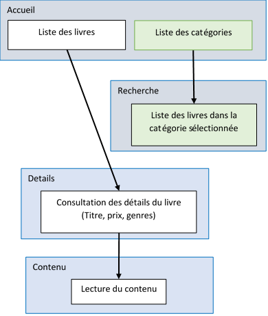

# TP .NET

# But
Construire un web service avec son client Windows pour gerer et consulter une bibliothèque de livres
# A rendre
Un web service de stockage et de gestion de livres en ligne

Un logiciel sous Windows pour consulter et lire les livres
# Contrainte
Langages autorisés : C#, HTML, Javascript, CSS, TypeScript

Serveur web : ASP.Net Core

Logiciel Windows : WPF
# Projet de départ
Votre solution devra être basé sur le projet Library.sln

La partie server est dans le projet ASP.Server

La partie client est dans le projet WPF.Reader

La connexion entre votre client et votre serveur est dans le projet WPF.Reader.OpenApi
# Aide
1) Pour éviter les boucles infinies entre genre et livre lors de la conversion en JSON:
    - Utiliser un ou plusieur DTO (voir plus bas)

---

2) Pour renvoyer un objet différent de celui contenu dans votre base utilisé un DTO
    - Vous fait votre DTO à la main: <https://learn.microsoft.com/en-us/aspnet/web-api/overview/data/using-web-api-with-entity-framework/part-5>
    - Vous utiliser la librairie AutoMapper: <https://automapper.org/> 

---

3) Pour que Entity Framework retourne les genres avec les livres : 

    - Utilisez la méthode Include : `libraryDbContext.Books.Include(b => b.Genres).Where(x => x.Price > 0)`
    - Utiliser le LazyLoading
      - <https://learn.microsoft.com/en-us/ef/ef6/querying/related-data>

---

4) En WPF certain évenements ne suportent pas les comandes utilisez le package [Microsoft.Xaml.Behaviors.Wpf](https://www.nuget.org/packages/Microsoft.Xaml.Behaviors.Wpf)
      - Exemple  
        view.xaml
        ```xml
        <page xmlns:behaviours="http://schemas.microsoft.com/xaml/behaviors">
          ...
          <ListBox ItemsSource="{Binding ChangeMe}">
            <behaviours:Interaction.Triggers>
              <behaviours:EventTrigger EventName="SelectionChanged">
                  <behaviours:InvokeCommandAction Command="{Binding SelectionChangedCommand}" PassEventArgsToCommand="True"/>
              </behaviours:EventTrigger>
            </behaviours:Interaction.Triggers>
          </ListBox>
          ...
        </page>
        ```
        viewmodel.cs
        ```cs
        private RelayCommand selectionChangedCommand;
        public ICommand SelectionChangedCommand => selectionChangedCommand ??= new RelayCommand(SelectionChanged);
    
        private void SelectionChanged(object commandParameter)
        {
    
        }
        ```

# Fonctionnalité attendue
## Livrable
- [Une interface d'administration](#Administration)
- [Une API REST](#Api)
- [un Client lourd de lecture](#Application-Windows)

## Librairie
Stocker une bibliothèque de livres consistant en :

- Une liste de livres accessibles à la lecture
- Une liste de genres permettant de caractériser les livres

Sachant que :

- Un livre contient au minimum :
  - Un Id
  - Un titre
  - Un contenu
  - Un prix
  - Des genres
- Un livre peut avoir plusieurs genres

# Administration
Il est nécessaire pour ces fonctionnalités de mettre à disposition de l’utilisateur une interface web

Un utilisateur doit pouvoir :

- ajouter des livres dans la bibliothèque
- supprimer des livres de la bibliothèque
- Consulter la liste de tous les livres
- Consulter la liste de tous les genres
- Faire une interface pour ajouter de nouveaux genres 
- Modifier un livre existant

Options :
- Remplacer le champs autheur (de type string) de la classe livre par une laison vers une classe Autheur
  - Un livre peut evoir plusieur autheur
  - La class autheur à besoin d'au minimum du nom de l'autheur
- Afficher des filtres dans la liste des livres pour filtrer par autheurs / genres
- Une page affichants les statistiques sur :
  - le nombre de libres total disponible
  - le nombre de livres par autheur
  - Le nombre maximum, minmum, median et moyen de mots d'un livre
- Importer les details d'un livre par l'OpenLibrary
  - https://openlibrary.org/
  - Pouvoir rentrer un contenu + isbn
  - récupéré l'auteur + description et l'ecrire en base

Une ébauche de ce qui est attendu ce trouve dans ASP.Server/Controllers/BookController.cs et GenreController.cs


# Api
Une api REST doit être mis à disposition pour permettre à des clients externes de consulter la librairie

Une ébauche de ce qui est attendu ce trouve dans le fichier ASP.Server/Api/BookController.cs

Cette api doit permettre de :
- Récupérer un livre avec son contenu
- Lister les genres disponibles
- Lister les livres (sans le contenu)

Options:
- Utiliser un plugin pour changer le format de sortie
    - le plugin ne doit pas faire partie de la solution. Il doit etre charger à partir d'un dossier en contenant plusieurs.
    - Mettez a disposition un moyen pour pouvoir créer un nouveau plugin compatible avec votre solution
    - Vous ne conaissez pas la liste des plugins en avance, il doivent être chargés dynamiquement
    - les paramètres de l'API permettent de choisir le plugin a utiliser (/book/{id}?output=xxx)
    - Pas de package exterieur autorisé !
- Faite pareil mais avec des plugins codés dans un language compilé (C, C++, RUST, ...)
- Rajouter la possibilité de décharger la DLL

## Récupérer un livre avec son contenu : /book/{id} 
Exemple:
```json
{
    "Id": 1, "Name": "titre", "Prix": 10.5, "Content": "contenu",
    "Genres": [{ "Id": 1, "Name": "Genre" }]
}
```
## Lister les genres disponibles: /genre
Exemple:
```json
[{
    "Id": 1, "Name": "Genre"
}, {
    "Id": 2, "Name": "Genre2"
}, { 
    …
}]
```

## Lister les livres (sans le contenu) : 
- Le résultat doit être paginé
- La recherche doit aussi pouvoir être faite en spécifiant un genre
- La réponse doit contenir un header qui contient l'index de début et de fin des livres que vous retournez ainsi que le nombre total de livres de votre séléction

Exemple Header:
- /book?offset=10&limit=15
```http
HTTP/1.1 200
Content-Type: application/json
Pagination: 10-25/536
```
Exemple Body :
- /book
```json
[{
    …
}, {
    "Id": 5, "Name": "titre", "Prix": 10.5,
    "Genres": [{ "Id": 3, "Name": "Genre" }]
}, { 
    … 
}, {
    "Id": 15, "Name": "titre2", "Prix": 12.5,
    "Genres": [{ "Id": 3, "Name": "Genre" }]
}, { 
    … 
}, {
    "Id": 20, "Name": "titre2", "Prix": 13.5,
    "Genres": [{ "Id": 3, "Name": "Genre" }]
}]
```

- /book?limit=10&offset=20
```json
[{
    "Id": 10, "Name": "titre", "Prix": 10.5, 
    "Genres": [{ "Id": 3, "Name": "Genre" }]
}, {
    "Id": 11, "Name": "titre2", "Prix": 12.5,
    "Genres": [{ "Id": 6, "Name": "Genre6" }]
}]
```

- /book?genre=3
```json
[{
    "Id": 5, "Name": "titre", "Prix": 10.5,
    "Genres": [{ "Id": 3, "Name": "Genre" }]
}, {
    "Id": 15, "Name": "titre2", "Prix": 12.5, 
    "Genres": [{ "Id": 3, "Name": "Genre" }]
}, {
    "Id": 20, "Name": "titre2", "Prix": 13.5, 
    "Genres": [{ "Id": 3, "Name": "Genre" }]
}]
```
- /book?limit=2&offset=20&genre=3 -> 
```json
[{
    "Id": 5, "Name": "titre", "Prix": 10.5,
    "Genres": [{ "Id": 3, "Name": "Genre" }]
}, {
    "Id": 15, "Name": "titre2", "Prix": 12.5,
    "Genres": [{ "Id": 3, "Name": "Genre" }]
}]
```

Il est conseiller d’utiliser :

- NSwagg (<https://docs.microsoft.com/en-us/aspnet/core/tutorials/getting-started-with-nswag?view=aspnetcore-5.0&tabs=visual-studio>)

pour générer un fichier OpenApi automatiquement, cela accélèrera grandement le développement du client. 

La solution fournie intègre NSwag par défaut


# Application Windows
## Affichage
L’application doit pouvoir permettre de :

- Lister les *N* premiers livres (vous pouvez définir la limite comme bon vous semble)
- Afficher les détails d’un livre
- Lire un livre

Options :

- Lister tous les genres
- Afficher les *N* premiers livres d’un genre (vous pouvez définir la limite comme bon vous semble)
- Gerer la pagination de vos livres (Scroll infini, pages ou autres)
- Afficher un livre avec formatage: Style de police, couleur, taille du texte, ...
  - Pensé au RTF, HTML, PDF, ...
  - Dans un premier temps gérez uniquement 1 format. Si vous avez finit, vous pouvez gérer plusieurs formats en même temps
- Lire le livre grace à l'API [System.Speech.SpeechSynthesizer](https://learn.microsoft.com/en-us/dotnet/api/system.speech.synthesis.speechsynthesizer?view=netframework-4.8.1&viewFallbackFrom=net-7.0)
  - Géré la lecture / l'arrêt / la pause / la reprise
  - Changer les boutons de controle en fonction de l'état de la lecture (comme un lecteur vidéo, ex: youtube)
  - Commencer à lire a partir de la séléction de l'utilisateur, L'utilisateur doit pouvoir faire un clic droit sur un mot et lancer la lecture a partir de ce mot

À tout moment l’utilisateur doit pouvoir revenir à l’accueil, il n’est pas nécessaire de faire un bouton pour revenir à la page précédente

Les écrans doivent s’articuler de la façon suivante :



Les carrés bleus représentent un écran
Les carrés blancs représentent une fonctionnalité disponible sur l’écran
Les carrés verts sont optionnels

## Api
L’application doit pouvoir recevoir les livres depuis le serveur développé dans la partie précédente

Pour générer le code client vous pouvez utiliser :

- Utiliser la librairie WPF.Reader.OpenApi (mettez la à jour par contre !)
    - Assurer vous que votre serveur fonctionne 
    - Depuis Visual Studio selectionner le projet WPF.Reader.OpenApi -> Clicker sur projet depuis le menu -> Services connectés -> Gérer les services connectés -> Clicker sur les 3 points (...) sur la ligne <swagger - Client> -> Actualiser
- OpenAPI Generator Plugin (<https://marketplace.visualstudio.com/items?itemName=ChristianResmaHelle.ApiClientCodeGenerator2022>)
- OpenApi Generator (<https://github.com/OpenAPITools/openapi-generator>)
- Unchased NSwag (<https://marketplace.visualstudio.com/items?itemName=Unchase.unchaseopenapiconnectedservice>) 
- NswagStudio (<https://github.com/RicoSuter/NSwag/wiki/NSwagStudio>)
- ou un autre

Vous pouvez sinon faire les requêtes à la main grâce à :

- HttpClient ([System.Net.Http](https://docs.microsoft.com/en-us/dotnet/api/system.net.http?view=net-5.0))
- Restsharp (<https://www.nuget.org/packages/RestClient.Net/>)


